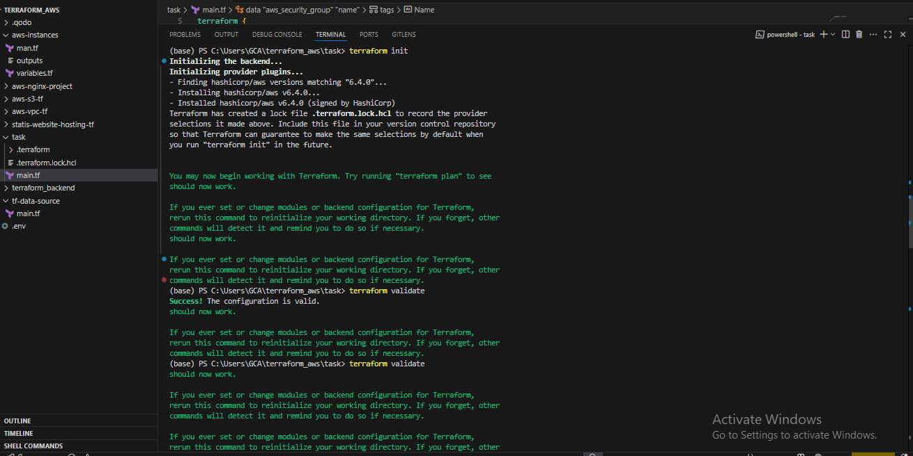
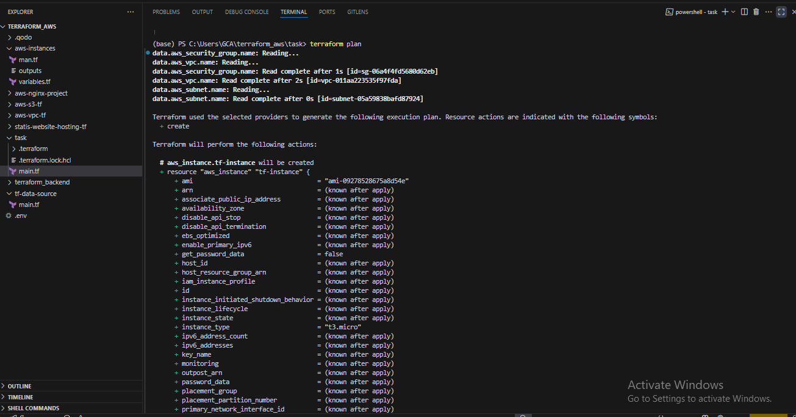
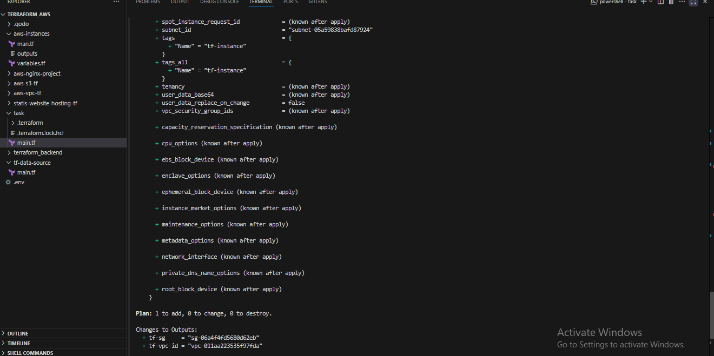
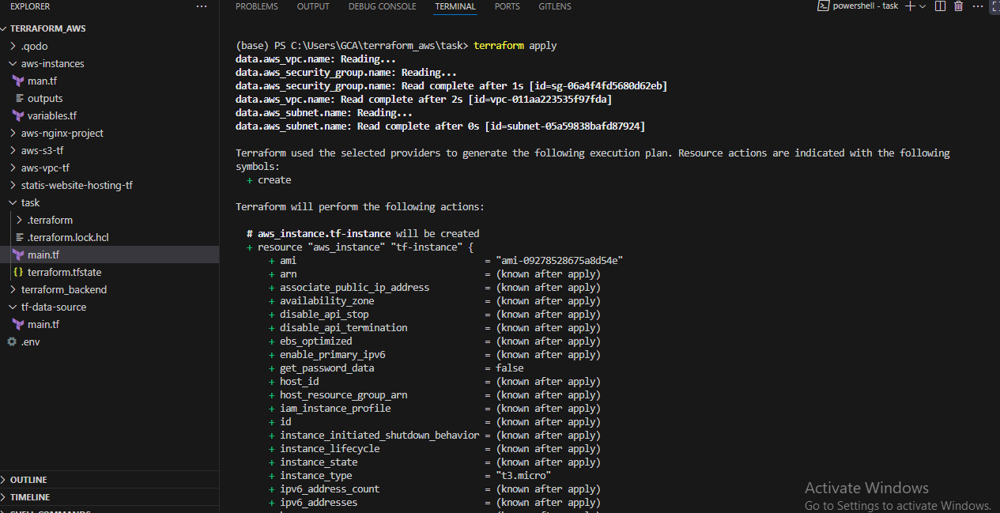
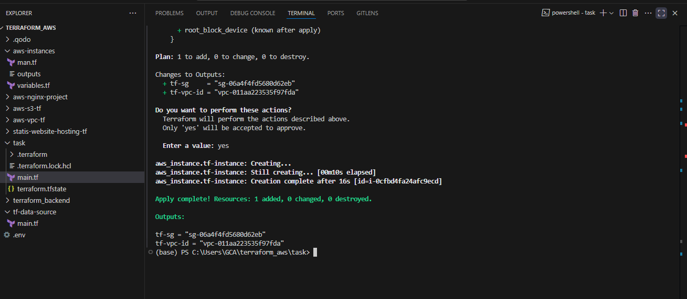
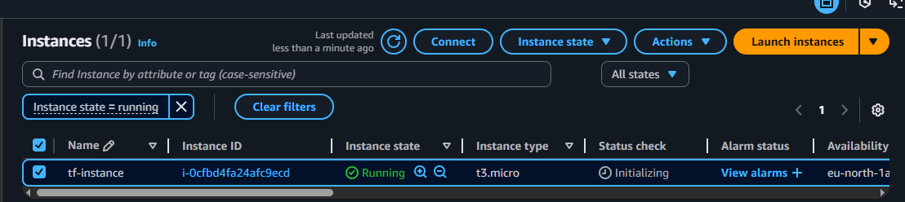
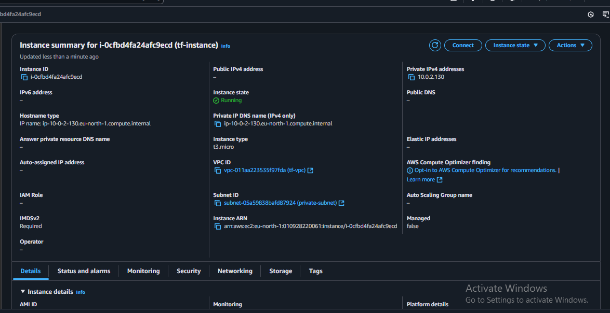

# Terraform AWS EC2 Instance Deployment

This Terraform configuration deploys an EC2 instance in an existing AWS VPC infrastructure in the `eu-north-1` region.

## Project Overview

This project creates a single EC2 instance (`t3.micro`) within an existing VPC setup, utilizing predefined security groups and private subnets. The infrastructure references existing AWS resources rather than creating new networking components.

## Architecture

- **Provider**: AWS (eu-north-1 region)
- **Instance Type**: t3.micro
- **AMI**: ami-09278528675a8d54e (Amazon Linux 2023)
- **Network**: Deployed in existing private subnet
- **Security**: Uses existing security group configuration

## Prerequisites

- AWS CLI configured with appropriate credentials
- Terraform installed (version compatible with AWS provider 6.4.0)
- Existing AWS infrastructure:
  - VPC tagged with `Name = "tf-vpc"`
  - Private subnet tagged with `Name = "private-subnet"`
  - Security group tagged with `Name = "tf-sg"`

## Configuration Details

### Data Sources
The configuration uses data sources to reference existing AWS resources:

- **VPC**: References existing VPC with tag `Name = "tf-vpc"`
- **Subnet**: References private subnet within the VPC with tag `Name = "private-subnet"`
- **Security Group**: References existing security group with tag `Name = "tf-sg"`

### Resources
- **EC2 Instance**: Creates a single t3.micro instance named `tf-instance`

### Outputs
- `tf-vpc-id`: VPC ID of the referenced VPC
- `tf-sg`: Security Group ID of the referenced security group

## Usage

### 1. Clone and Navigate
```bash
git clone <repository-url>
cd <project-directory>
```

### 2. Initialize Terraform
```bash
terraform init
```

### 3. Plan Deployment
```bash
terraform plan
```

### 4. Apply Configuration
```bash
terraform apply
```

### 5. Verify Deployment
Check the outputs to confirm the resources are correctly referenced:
```bash
terraform output
```

## Terraform Apply Output







## AWS Console Verification




## File Structure

```
.
├── main.tf                 # Main Terraform configuration
├── README.md              # This file
└── images/                # Screenshots directory
    ├── terraform-apply-1.png
    ├── terraform-apply-2.png
    ├── terraform-apply-3.png
    ├── terraform-apply-4.png
    ├── terraform-apply-5.png
    ├── aws-console-1.png
    ├── aws-console-2.png
    └── aws-console-3.png
```

## Important Notes

- The EC2 instance is deployed in a **private subnet**, so direct internet access may be limited
- Ensure the referenced security group has appropriate rules for your use case
- The AMI ID (`ami-09278528675a8d54e`) is specific to the eu-north-1 region
- All referenced resources (VPC, subnet, security group) must exist before running this configuration

## Cleanup

To destroy the created resources:
```bash
terraform destroy
```

**Note**: This will only destroy the EC2 instance, not the referenced VPC infrastructure.

## Security Considerations

- Review security group rules to ensure they meet your security requirements
- Consider using IAM roles for EC2 instances instead of embedding credentials
- Regularly update AMI IDs to use the latest patched versions

## Troubleshooting

### Common Issues
1. **Resource not found**: Ensure all tagged resources exist in the specified region
2. **Permission denied**: Verify AWS credentials have sufficient permissions
3. **Subnet/VPC mismatch**: Confirm the private subnet belongs to the referenced VPC

### Validation Commands
```bash
# Check if resources exist
aws ec2 describe-vpcs --filters "Name=tag:Name,Values=tf-vpc" --region eu-north-1
aws ec2 describe-subnets --filters "Name=tag:Name,Values=private-subnet" --region eu-north-1
aws ec2 describe-security-groups --filters "Name=tag:Name,Values=tf-sg" --region eu-north-1
```

## Contributing

1. Fork the repository
2. Create a feature branch
3. Make your changes
4. Test the configuration
5. Submit a pull request
